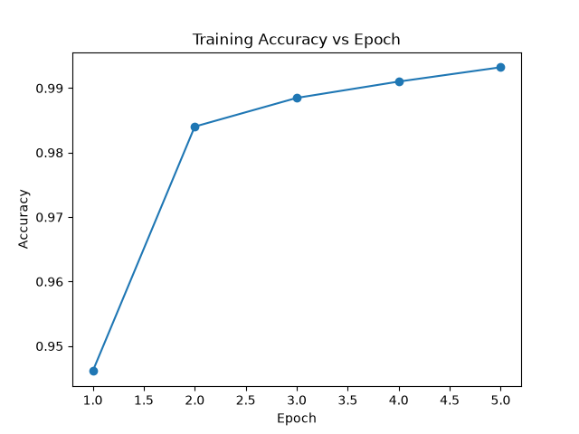
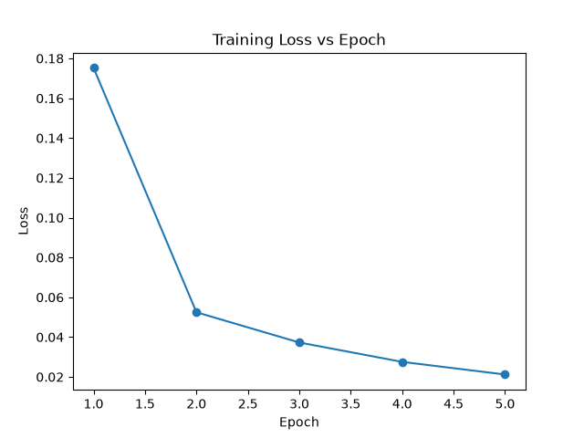

# Handwritten Digit Classification with CNN (Convolutional Neural Network) using PyTorch

A step-by-step, reproducible implementation of an image classification pipeline using PyTorch, built as a personal learning project on Deep Learning fundamentals. This repository documents the full workflow, from raw MNIST data to a trained CNN, evaluation metrics, confusion matrix analysis and single-image inference.

> 🎓 **Learning context:** This project was built with a personal educational goal, learning the fundamentals of Machine Learning and PyTorch, including tensors, convolutional architectures, the training/evaluation loop, backpropagation and model evaluation. It was developed with the support of a generative AI.

## Table of Contents

- [About the Dataset](#about-the-dataset)
- [Pipeline Overview](#pipeline-overview)
- [Environment Setup](#environment-setup)
- [Running the Analysis](#running-the-analysis)
- [Repository Structure](#repository-structure)
- [Viewing Results](#viewing-results)
- [Results](#results)
- [What I Learned](#what-i-learned)

## About the Dataset

The project uses the **MNIST** dataset, one of the most widely used introductory benchmarks in computer vision, consisting of:

- 60,000 training images and 10,000 test images
- Grayscale images, 28×28 pixels
- 10 classes, corresponding to handwritten digits 0 through 9

The dataset is downloaded automatically via `torchvision.datasets.MNIST` and is not versioned in this repository.

Official dataset reference: [MNIST database (Yann LeCun et al.)](http://yann.lecun.com/exdb/mnist/)

## Pipeline Overview

```
Raw MNIST dataset (downloaded via torchvision)
│
▼
Preprocessing (ToTensor + Normalize)
│
▼
Dataset exploration & sample visualization
│
▼
CNN architecture (Conv2d → ReLU → MaxPool2d, twice → Flatten → Linear)
│
▼
Training loop (CrossEntropyLoss + Adam optimizer)
│
▼
Training curves (loss & accuracy per epoch)
│
▼
Evaluation on test set (model.eval() + torch.no_grad())
│
▼
Confusion matrix + correct/incorrect prediction analysis
│
▼
Model saving (state_dict) + single-image inference
```

Each stage of this pipeline corresponds to one module in the [`src/`](./src) folder (see [Repository Structure](#repository-structure)).

## Environment Setup

This project was run using the following stack:

```
Python → venv → pip → PyTorch / torchvision / NumPy / Matplotlib / scikit-learn
```

### 1. Create a virtual environment

```bash
python -m venv venv
source venv/bin/activate      # Linux/Mac
venv\Scripts\activate         # Windows
```

### 2. Install dependencies

```bash
pip install -r requirements.txt
```

Verify the install:

```bash
python -c "import torch; print(torch.__version__)"
```

## Running the Analysis

Clone this repository, then move into it:

```bash
git clone https://github.com/pedrocambui06/pytorch_handwritten_digit_classification.git
cd pytorch_handwritten_digit_classification
```

Activate your virtual environment (see above), then run the modules **in order**. Each one is commented and mirrors one stage of the pipeline described above.

| Step | Module | What it does |
|------|--------|---------------|
| 1 | `src/data.py` | Downloads MNIST, applies preprocessing, and builds DataLoaders |
| 2 | `src/utils.py` | Inspects dataset statistics and visualizes sample images |
| 3 | `src/model.py` | Defines the CNN architecture |
| 4 | `src/train.py` | Trains the model, plots training curves, and saves the trained weights |
| 5 | `src/evaluate.py` | Evaluates the model on the test set and generates the confusion matrix and prediction visualizations |
| 6 | `src/infer.py` | Loads the saved model and runs inference on a single test image |

You can run the full pipeline with:

```bash
python -m src.train
python -m src.evaluate
python -m src.infer
```

## Repository Structure

```
pytorch_handwritten_digit_classification/
├── README.md
├── requirements.txt
├── .gitignore
├── data/                # MNIST dataset (not versioned)
├── src/
│ ├── config.py          # Project-wide constants
│ ├── data.py            # Dataset loading & DataLoaders
│ ├── model.py           # CNN architecture
│ ├── train.py           # Training loop
│ ├── evaluate.py        # Evaluation & prediction analysis
│ ├── infer.py           # Model saving, loading & inference
│ └── utils.py           # Visualization utilities
├── models/
│ └── cnn_model.pth      # Saved trained model weights
├── images/              # README extra images
└── results/figures      # Generated plots and visualizations
```

## Viewing Results

All generated figures are plain PNG images and can be opened with any image viewer. They are located in `results/figures/`:

| File | Content |
|------|----------|
| `sample_images.png` | Grid of example MNIST digits with their true labels |
| `training_loss.png` | Training loss curve across epochs |
| `training_accuracy.png` | Training accuracy curve across epochs |
| `confusion_matrix.png` | Actual vs. predicted class heatmap on the test set |
| `predictions.png` | Sample test images with actual vs. predicted labels |
| `incorrect_predictions.png` | Examples of misclassified test images |

## Results

| Hyperparameter / Metric | Value |
|---------------------------|-------|
| Epochs                      | 5   |
| Batch size                    | 64 |
| Learning rate                   | 0.001 |
| Optimizer                         | Adam |
| Device                              | CPU |
| Test Accuracy                        | 99.06% |
| Test Loss                              | 0.0287 |






### Confusion matrix analysis:
The model performs very well across all classes, with most digits achieving over 950 correct predictions. Digit 1 is the most accurately classified (1130 correct out of 1135 samples, only 5 total misclassifications), while digit 4 has the fewest errors in absolute terms (only 2 misclassified). The most frequent single confusion is actual 9 predicted as 4 (9 cases), consistent with the well-known visual overlap between a closed-loop 9 and a 4 with a fully closed top. The second most common confusion is actual 6 predicted as 0 (5 cases), likely caused by 6s written with a rounded, closed loop that resembles a 0. Digit 8 shows a more scattered error pattern, with small misclassification counts spread across several different classes (0, 2, 3, 4, 5, 6, 7, 9) rather than concentrated on a single confusable digit, suggesting these errors behave closer to random noise than a systematic visual confusion.


### Error analysis:
Examining individual misclassified examples reinforces the patterns seen in the confusion matrix. Three of the ten sampled errors involve a 2 predicted as 7, in each case, the digit is written with a short, angular top stroke and a straight diagonal body, closely resembling how a 7 is typically drawn. Two samples show a 3 predicted as 5, both written with a rounded, partially closed bottom loop that visually approximates a 5. One sample labeled 6 is predicted as 0, the digit is drawn as a nearly closed loop with only a small opening, making it genuinely ambiguous between the two classes. Another sample labeled 9 is predicted as 8, drawn with a fully closed lower loop that gives it the double-loop appearance typical of an 8. Overall, these examples suggest that most of the model's mistakes occur on genuinely ambiguous handwriting samples, cases that a human reader could plausibly misclassify as well, rather than arbitrary or unexplainable failures.


## What I Learned

This project was my hands-on introduction to several concepts I can now build on for future work:

- What tensors are and how images are represented as them in PyTorch
- Building and training a Convolutional Neural Network from scratch with `nn.Module`
- The full training loop: forward pass, loss calculation, backpropagation, optimizer step
- The distinction between training mode and evaluation mode (`model.train()` vs `model.eval()` + `torch.no_grad()`)
- Interpreting a confusion matrix and identifying patterns in model errors
- Saving and loading model weights (`state_dict`) for reuse without retraining

---

Created by [Pedro C. Martins](https://github.com/pedrocambui06)

Feel free to open issues, propose improvements, or use this project for educational purposes
